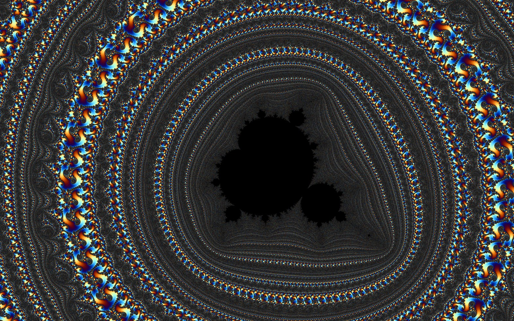
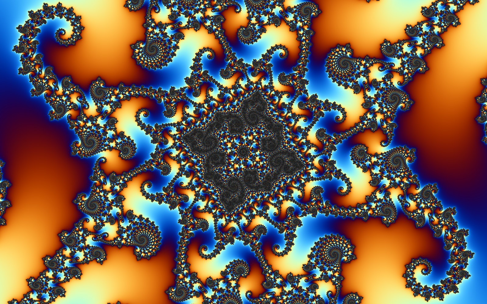

# fractal

A Mandelbrot set explorer in Rust that keeps zooming long after ordinary 64-bit maths gives out
(up to about 10^287×).



*A small copy of the set at 5·10³¹× zoom, far past where 64-bit floating point can tell pixels
apart. Period 8007, centre re = −0.74364388703715870475219150611477977821525620794818,
im = 0.13182590420531197049313205638514067897295227932892.*



*Seahorse valley at 3·10¹²× zoom, around a period-998 copy of the set.*

- **Deep zoom:** the screen centre's orbit is computed in arbitrary precision; every other pixel
  tracks only its small offset from it (perturbation, with rebasing to avoid glitches).
- **Iteration skipping:** at depth, pixels jump many iterations at once using precomputed linear
  steps (bilinear approximation).
- **Honest black:** a pixel is black only when its orbit is proven to settle into a cycle, so
  the small copies of the set stand out. The iteration limit rises by itself when too many
  pixels are still undecided.
- **Boundary shading** from a distance estimate keeps filaments crisp instead of noisy.

## Run

Needs Rust ([mise](https://mise.jdx.dev) installs the pinned version from `mise.toml`):

```
cargo run --release
```

## Controls

| Input | Action |
|---|---|
| Scroll / trackpad | Zoom at the cursor |
| Left click / right click | Zoom in / out 2× |
| Left drag | Pan |
| `+` / `-` | More / fewer iterations |
| `H` | Full Retina resolution (slower) |
| `F` | Full screen |
| `P` | Print the current location |
| `R` | Reset |
| `Esc` | Quit |
